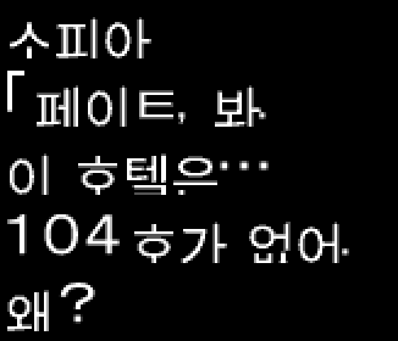

# Star Ocean 3 DC Korean Tools

『스타 오션 3 Till the End of Time Director's Cut』 일본판 PS2 Disc 1의
숨겨진 tri-Ace 아카이브, SLZ 압축, `so3mclib` 메시지·폰트 형식을 분석하고
한국어 출력 패치를 만드는 연구 도구입니다.

`v0.2.0-alpha.1`은 [이슈 #1](https://github.com/snake7594/so3dc-korean-tools/issues/1)의
게임 시작 후 첫 대사를 실제 메시지 ID 5에 넣습니다.

```text
소피아
「페이트, 봐.
이 호텔은…
104호가 없어.
왜?
```

원문의 의미와 진행 순서를 유지하면서 원래 124바이트 메시지 구간에 맞춘 축약
번역입니다.



> 아직 전체 한글패치가 아닌 알파 단계의 첫 대사 검증판입니다.

## 지원 원본

- 게임: 일본판 Director's Cut Disc 1
- 제품 코드: `SLPM-65438`
- ISO 크기: `4,689,854,464` bytes
- 원본 ISO SHA-256:
  `95CC4E25AC71DE7C6263AA2E544910DE30667EA3BA62726CF4A019F24B038826`

해시가 다른 덤프에는 릴리스 xdelta를 적용하지 마세요.

## v0.2.0-alpha.1 xdelta 적용

GitHub Releases에서
`SO3_DC_Disc1_Korean_First_Dialogue_v0.2.0-alpha.1.zip`을 받아 풀고, 동봉된
xdelta를 다음 순서로 적용합니다. ZIP에는 OFL 원문과 체크섬도 들어 있습니다.

```powershell
xdelta3 -d -s "SO3_DC_Disc1_original.iso" `
  "SO3_DC_Disc1_Korean_First_Dialogue_v0.2.0-alpha.1.xdelta" `
  "SO3_DC_Disc1_Korean_First_Dialogue.iso"
```

검증 해시:

- 릴리스 ZIP SHA-256:
  `1B7C7E48F440D7F2B82CD65D0E31F025ED6F472FBBE83DE69922629875237893`
- xdelta SHA-256:
  `D0F053E5972D7F1E4C045D706DE028C00513DC814641A9A093BFAB3571C2788B`
- 생성 ISO SHA-256:
  `BBC366A55DA0C2C985BB7E5329A7D2FE8674913995EEB4C81E9674C1E42AF27C`

## 소스에서 ISO 생성

Python 3.10 이상, `requirements.txt`, 한글을 지원하는 OFL 호환 TTF/OTF가
필요합니다. 공식 릴리스는 Noto Sans CJK KR Regular 2.004와 Pillow 11.1.0으로
만들었습니다. 해당 글꼴은 copyright © 2014-2021 Adobe이며
[고정된 Noto CJK 2.004 소스](https://github.com/notofonts/noto-cjk/blob/523d033d6cb47f4a80c58a35753646f5c3608a78/Sans/OTF/Korean/NotoSansCJKkr-Regular.otf)에서
받을 수 있습니다.

```powershell
python -m pip install -r requirements.txt
python tools/patch_first_dialogue.py `
  "SO3_DC_Disc1_original.iso" `
  "SO3_DC_Disc1_Korean_First_Dialogue.iso" `
  --font "NotoSansCJKkr-Regular.otf" `
  --preview "first_dialogue_preview.png" `
  --report "patch_report.json"
```

공식 빌드 글꼴 SHA-256:
`6BCB2A0703AA137E874FC2DFFA85F6C21BA9A67FA329E81B8C801663AF7E992A`

폰트 파일 자체는 저장소나 릴리스에 넣지 않습니다. 사용한 Noto 글리프 파생물은
SIL Open Font License 1.1을 따르며 원문은
[`LICENSES/NotoSansCJK-OFL-1.1.txt`](LICENSES/NotoSansCJK-OFL-1.1.txt)에
포함되어 있습니다. 저작권 고지는
[`LICENSES/NotoSansCJK-COPYRIGHT.txt`](LICENSES/NotoSansCJK-COPYRIGHT.txt)를
참고하세요.

## 독립 검증

```powershell
python tools/verify_first_dialogue_iso.py `
  "SO3_DC_Disc1_original.iso" `
  "SO3_DC_Disc1_Korean_First_Dialogue.iso" `
  --full-diff `
  --report "verification.json"

python -m unittest discover -s tests -v
```

최종 빌드는 다음을 통과했습니다.

- 숨겨진 6,144-entry 인덱스 불변
- archive 8의 4개 root stream 검증
- archive 1220 첫 PK1의 상위 record 12개 중 목표 1개만 내용 변경
- 로컬 전체 추출 manifest의 root SLZ stream 63개 중 62개 decoded 내용 불변
- 로컬 글리프 operand 108개를 빠짐없이 `+6` 이동하고 기존 72개 bitmap 보존
- 4,689,854,464바이트 전수 비교에서 허용한 archive 8·1220 밖 변경 0바이트
- xdelta 역적용 출력이 최종 ISO SHA-256과 일치

자세한 구조와 검증값은
[`docs/FIRST_DIALOGUE_PATCH.md`](docs/FIRST_DIALOGUE_PATCH.md)를 참고하세요.

## 현재 제한

- 첫 대사만 한국어로 바꾼 알파 검증판입니다.
- 지원 원본의 archive 해시와 구조가 조금이라도 다르면 패처가 중단됩니다.
- 릴리스 빌드는 고정 공간에 맞추기 위해 24×24 셀 안에 22px 글리프를 4단계
  명암으로 양자화합니다.
- ISO, 실행 파일, 추출 게임 데이터, BIOS, PCSX2 세이브스테이트, 상용 폰트는
  포함하지 않습니다.

## 법적 고지

이 프로젝트는 비공식 팬 연구 프로젝트이며 tri-Ace, Square Enix, Sony와 관계가
없습니다. 반드시 적법하게 소유한 원본 디스크 덤프를 사용하세요.
