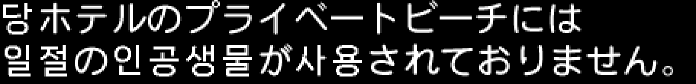

# Star Ocean 3 DC Korean Tools

『스타 오션 3 Till the End of Time Director's Cut』 일본판 PS2 Disc 1의
숨겨진 tri-Ace 아카이브, SLZ 압축, `so3mclib` 메시지·폰트 형식을 분석하고
한국어 출력 패치를 만드는 연구 도구입니다.

`v0.3.0-alpha.1`은 첫 대사 한글 출력 패치에 NanumSquare Neo Bold 글리프를
적용하고, 초반 호텔 장면에서 쓰이는 일본어 한자 13자의 bitmap을 확인용 한국어
독음으로 바꿉니다.

```text
号 → 호    室 → 실    無 → 무    何 → 하
当 → 당    一 → 일    切 → 절    人 → 인
工 → 공    生 → 생    物 → 물    使 → 사    用 → 용
```

예를 들어 원래 화면의 다음 문구는 한자 부분만 한국어 독음으로 보입니다.

```text
当ホテルのプライベートビーチには
一切の人工生物が使用されておりません。

↓

당ホテルのプライベートビーチには
일절の인공생물が사용されておりません。
```



첫 대사도 이전 릴리스와 동일하게 유지됩니다.

```text
소피아
「페이트, 봐.
이 호텔은…
104호가 없어.
왜?
```

> 아직 전체 한글패치가 아닙니다. 한자 bitmap 교체와 NanumSquare Neo의 실제
> 출력 상태를 확인하기 위한 알파 검증판이며, `v0.3.0-alpha.1`의 에뮬레이터
> 런타임 검증은 사용자가 진행합니다.

## 지원 원본

- 게임: 일본판 Director's Cut Disc 1
- 제품 코드: `SLPM-65438`
- ISO 크기: `4,689,854,464` bytes
- 원본 ISO SHA-256:
  `95CC4E25AC71DE7C6263AA2E544910DE30667EA3BA62726CF4A019F24B038826`

해시가 다른 덤프에는 릴리스 xdelta를 적용하지 마세요.

## v0.3.0-alpha.1 xdelta 적용

GitHub Releases에서
`SO3_DC_Disc1_Korean_Kanji_Readings_Nanum_v0.3.0-alpha.1.zip`을 받아 풀고
다음 순서로 적용합니다.

```powershell
xdelta3 -d -s "SO3_DC_Disc1_original.iso" `
  "SO3_DC_Disc1_Korean_Kanji_Readings_Nanum_v0.3.0-alpha.1.xdelta" `
  "SO3_DC_Disc1_Korean_Kanji_Readings_Nanum.iso"
```

검증 해시:

- 릴리스 ZIP SHA-256: `EE9DB79B1330A05882A35151D3A95458BDC3BC20FA6DFB8C9F29F276731DB0FE`
- xdelta SHA-256: `A35D924CA7273DDA676D20AAB74815E3A3BB64DDF71CA212B7534780114DA5A3`
- 생성 ISO SHA-256:
  `FD298A889002FF3AC23B43CF8433B1BE50EECC15ACE81E61DD48B759DF800F9B`

## 소스에서 ISO 생성

Python 3.10 이상, `requirements.txt`, `NanumSquareNeo-cBd.ttf`가 필요합니다.
폰트 파일은 원본 ISO와 같은 폴더에 두거나 `--font`로 경로를 지정합니다.

```powershell
python -m pip install -r requirements.txt
python tools/patch_early_kanji_readings.py `
  "SO3_DC_Disc1_original.iso" `
  "SO3_DC_Disc1_Korean_Kanji_Readings_Nanum.iso" `
  --font "NanumSquareNeo-cBd.ttf" `
  --preview "early_kanji_reading_preview.png" `
  --report "patch_report.json"
```

공식 빌드 글꼴 SHA-256:
`4749FA5691157CF56A59D297B45E88894A646846048018CD7A4117FFB2869767`

공식 빌드는 24×24 셀 안에 22px 글리프를 3단계 명암으로 양자화했습니다.
NanumSquare Neo는 NAVER와 Sandoll이 제공하며 SIL Open Font License 1.1을
따릅니다. 폰트 파일 자체는 저장소나 릴리스에 넣지 않습니다.
저작권 고지와 라이선스 전문은
[`LICENSES/NanumSquareNeo-COPYRIGHT.txt`](LICENSES/NanumSquareNeo-COPYRIGHT.txt)와
[`LICENSES/NanumSquareNeo-OFL-1.1.txt`](LICENSES/NanumSquareNeo-OFL-1.1.txt)를
참고하세요.

## 독립 검증

```powershell
python tools/verify_early_kanji_readings.py `
  "SO3_DC_Disc1_original.iso" `
  "SO3_DC_Disc1_Korean_Kanji_Readings_Nanum.iso" `
  --report "verification.json"

python -m unittest discover -s tests -v
```

최종 빌드는 다음 정적 검증을 통과했습니다.

- v0.3 전용 테스트 `13`개 및 전체 테스트 `28`개 통과
- 숨겨진 6,144-entry 인덱스 불변
- 전역 glyph count `292 → 306`, 압축 payload `25,383 / 25,440` bytes
- archive 1220의 목표 bitmap 13개만 교체하고 width table과 메시지 bytecode 보존
- 목표 record allocation `10,448` bytes 유지, 내부 미사용 공간 `572` bytes
- 첫 PK1 table과 비목표 record 11개, 두 번째 PK1 package 불변
- 4,689,854,464바이트 전수 비교에서 허용한 archive 8·1220 밖 변경 `0` bytes

구조와 상세 검증값은
[`docs/EARLY_KANJI_READING_PATCH.md`](docs/EARLY_KANJI_READING_PATCH.md)와
[`docs/releases/v0.3.0-alpha.1-verification.md`](docs/releases/v0.3.0-alpha.1-verification.md)를
참고하세요.

## 현재 제한

- 첫 대사와 초반 호텔 장면의 한자 13자만 대상으로 합니다.
- 한자 bitmap을 한국어 독음 bitmap으로 교체했을 뿐, 문장 전체를 번역하지는
  않았습니다.
- 같은 local glyph를 공유하는 해당 장면의 다른 메시지에서도 교체된 독음이
  나타납니다.
- 지원 원본의 archive 해시와 구조가 조금이라도 다르면 패처가 중단됩니다.
- `v0.3.0-alpha.1`은 정적 구조·해시 검증까지 완료했으며 에뮬레이터 출력 확인은
  사용자 검증 항목입니다.
- ISO, 실행 파일, 추출 게임 데이터, BIOS, PCSX2 세이브스테이트, 폰트 파일은
  포함하지 않습니다.

## 법적 고지

이 프로젝트는 비공식 팬 연구 프로젝트이며 tri-Ace, Square Enix, Sony와 관계가
없습니다. 반드시 적법하게 소유한 원본 디스크 덤프를 사용하세요.
