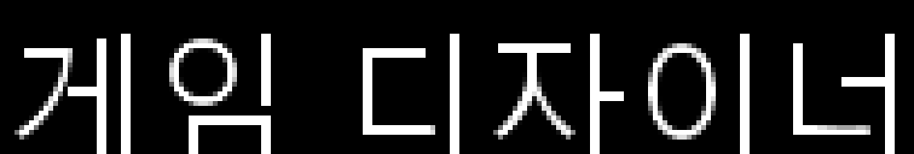

# Star Ocean 3 DC Korean Tools

『스타 오션 3 Till the End of Time Director's Cut』 일본판 PS2 Disc 1의
숨겨진 tri-Ace 아카이브, SLZ 압축, `so3mclib` 메시지/폰트 형식을 분석하고
첫 스태프 크레딧 `Game Designer`를 `게임 디자이너`로 바꾸는 초기
한국어 출력 POC입니다.

> 이 릴리스는 완성 한글패치가 아닙니다. 구조 분석과 첫 텍스트 출력용
> **알파 버전**입니다.



## v0.1.0-alpha.1에 포함된 것

- 6,144개 엔트리의 암호화된 tri-Ace 인덱스 해독
- SLZ mode 2 압축/해제
- `so3mclib` 메시지 테이블과 24×24/32×32 4bpp 글리프 처리
- 원본 ISO를 수정하지 않고 별도 ISO를 만드는 범위 검사형 리패커
- 첫 크레딧 메시지 ID 10의 `게임 디자이너` POC
- 원본 게임 파일을 포함하지 않는 xdelta 릴리스 자산

## 지원 원본

- 게임: 일본판 Director's Cut Disc 1
- 제품 코드: `SLPM-65438`
- ISO 크기: `4,689,854,464` bytes
- 원본 ISO SHA-256:
  `95CC4E25AC71DE7C6263AA2E544910DE30667EA3BA62726CF4A019F24B038826`

해시가 다른 덤프에는 릴리스 xdelta를 적용하지 마세요.

## xdelta 적용

GitHub Releases에서
`SO3_DC_Disc1_Korean_First_Text_v0.1.0-alpha.1.xdelta`를 받은 뒤,
xdelta3 또는 Delta Patcher 계열 도구에서 다음 순서로 지정합니다.

1. 원본: 위 SHA-256과 일치하는 Disc 1 ISO
2. 패치: 다운로드한 `.xdelta`
3. 출력: 새 ISO 파일

예시:

```powershell
xdelta3 -d -s "SO3_DC_Disc1_original.iso" `
  "SO3_DC_Disc1_Korean_First_Text_v0.1.0-alpha.1.xdelta" `
  "SO3_DC_Disc1_Korean_First_Text.iso"
```

생성되는 POC ISO의 SHA-256:
`3729A58B52DA7E0458F7B9E3B23CDAB0C102547B3DA4EC2028BEA2E597485176`

## 소스에서 ISO 생성

Python 3.10 이상과 Pillow가 필요합니다.

```powershell
python -m pip install -r requirements.txt
python so3_repack.py `
  "SO3_DC_Disc1_original.iso" `
  "SO3_DC_Disc1_Korean_First_Text.iso" `
  --member-offset 0x1D621000 `
  --message-id 10 `
  --text "게임 디자이너" `
  --strategy reuse `
  --reuse-codes 1,2,3,4,6,7 `
  --space-code 5 `
  --font "C:\Windows\Fonts\malgun.ttf"
```

원본 ISO는 읽기 전용으로 열며 출력 ISO를 별도로 만듭니다. 다른 운영체제에서는
한글을 포함하는 TTF/OTF 경로를 `--font`로 지정하세요.

## 검증 결과

- 원본 데이터가 필요 없는 공개 합성 테스트 8개 통과
- 원본 추출 샘플을 사용한 로컬 통합 테스트 5개 통과
- 원본/패치 ISO의 서로 다른 바이트: 121,701
- 모든 차이가 선택한 SLZ 멤버 `0x1D621000` 내부에만 존재
- 다음 chained member의 첫 64 KiB가 원본과 동일
- 해제된 mclib 차이가 메시지 10과 글리프 슬롯 6개에만 한정
- 패치 ISO가 PCSX2에서 세이브스테이트 없이 부팅되어 타이틀까지 진행됨

목표 한국어 크레딧 카드의 최종 런타임 화면 캡처는 아직 진행 중입니다.

## 현재 제한

- 전체 번역이 아닌 첫 텍스트 출력 POC입니다.
- `reuse` 방식은 동일 32px 아틀라스의 기존 슬롯 6개를 교체하므로 이후 크레딧의
  일부 글자에 영향을 줄 수 있습니다.
- SLZ 스트림 재배치는 지원하지 않습니다. 재압축 결과가 기존 할당 범위에 들어갈
  때만 출력합니다.
- 게임 ISO, 실행 파일, 추출 데이터, BIOS, 상용 폰트는 포함하지 않습니다.

자세한 형식 분석은 [docs/ANALYSIS.md](docs/ANALYSIS.md), 첫 메시지 선정 근거는
[docs/FIRST_TEXT_LOCATOR.md](docs/FIRST_TEXT_LOCATOR.md)를 참고하세요.

## 법적 고지

이 프로젝트는 비공식 팬 연구 프로젝트이며 tri-Ace, Square Enix, Sony와 관계가
없습니다. 반드시 적법하게 소유한 원본 디스크 덤프를 사용하세요.
